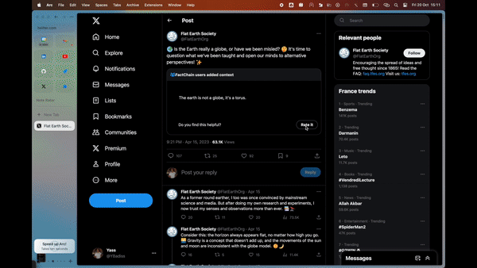
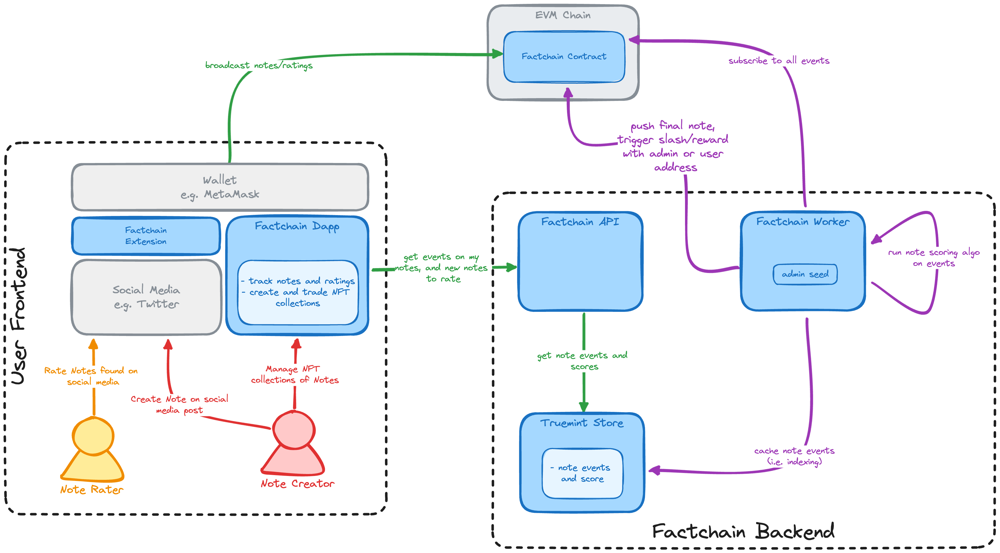

  

# factchain-community

Decentralized notes, decentralized rewards. A collaborative approach to combating misinformation, block by block.

Contributors to Factchain Community can record notes about any social media post on the blockchain. If enough contributors from different viewpoints rate a note as helpful on the blockchain, the note will be displayed on factchain.tech, and on the Factchain browser extension.

- Notes & votes are permissionless. No central authority to trust.
- Transparent incentives for note writers & voters. FactChain rewards writers who create helpful notes & voters who identify helpful/misleading notes
- Factchain's truth layer works for any social media platform:
  - Factchain's browser extension adds FactChain notes on top of social media posts
  - Anyone can query the Factchain API for notes on social media posts

## Links

- [Pitch Deck](https://docs.google.com/presentation/d/1SVDxzgBY_GsQRAT_anoVA7sfMu26-kKfJJI6M455bC0/edit?usp=sharing)
- [Demo of the PoC](https://drive.google.com/file/d/1tJgjMYLVi_VUSCHalCxqlsctuYiVFX4W/view?usp=share_link).
- The contract is deployed at https://sepolia.etherscan.io/address/0xb912368c62D3037F7E86C2e95D9B5F4FC86c9428.

## Using Factchain

### Requirements

- Desktop only
- Google Chrome
- Metamask
- Sepolia account some ETH (https://sepoliafaucet.com/ to get some)

### Installation

- Install the [Factchain extension](./fc-community-extension/) by drag-and-dropping [build.crx](./fc-community-extension/build.crx) into `chrome://extensions`.
- Open the extension so it can connect to your Metamask account
- Open Twitter which will also connect to your Metamask account

### Create a note

- Select a post you want to create a note on, and click on the 3 dots
- Click on `Create Factchain Note` and go through the steps

### Rate a note

- Open a post with an existing note you want to rate
- The note will be visible under the post
- Click on `Rate it` and go through the steps

## Project Architecture

